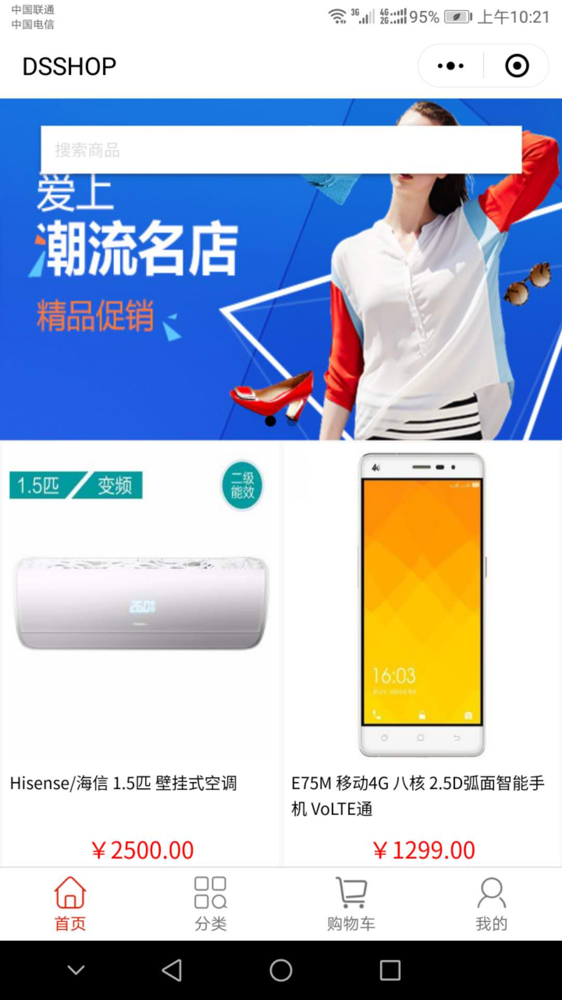
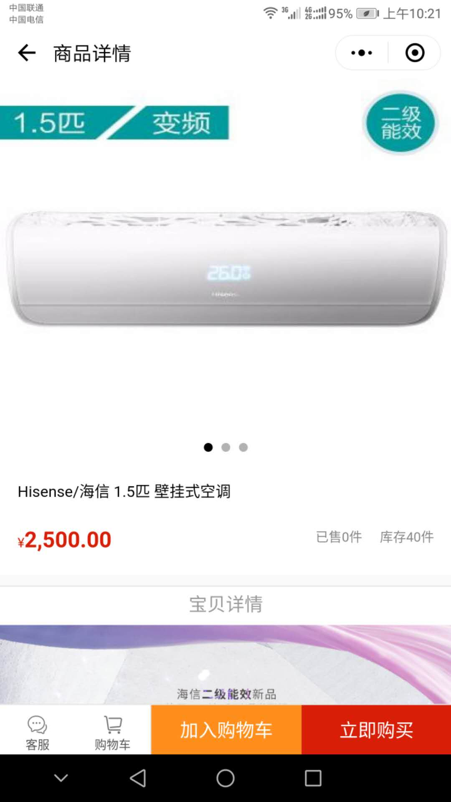
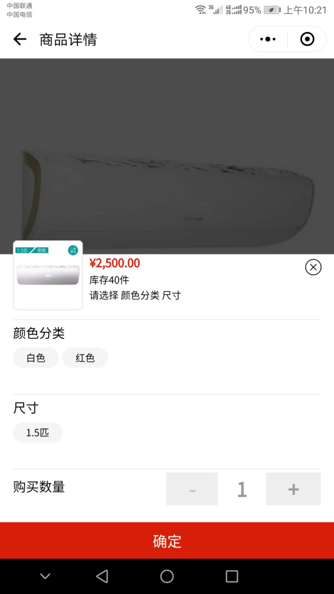
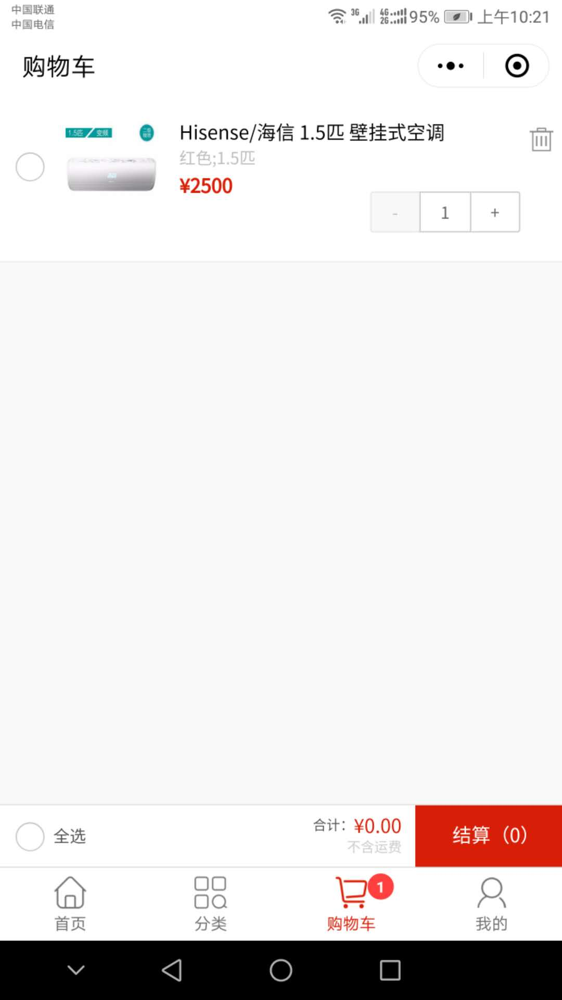
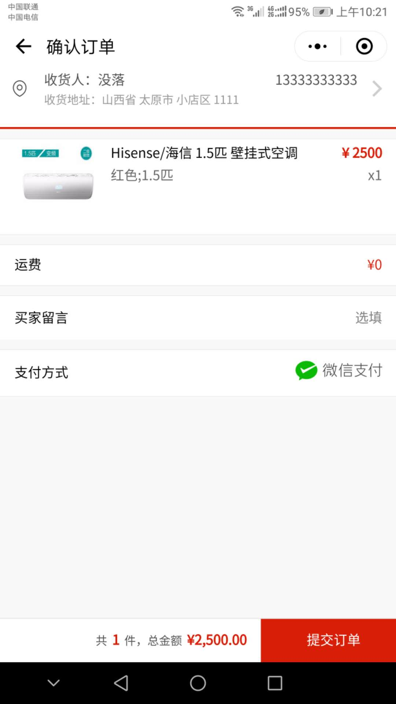
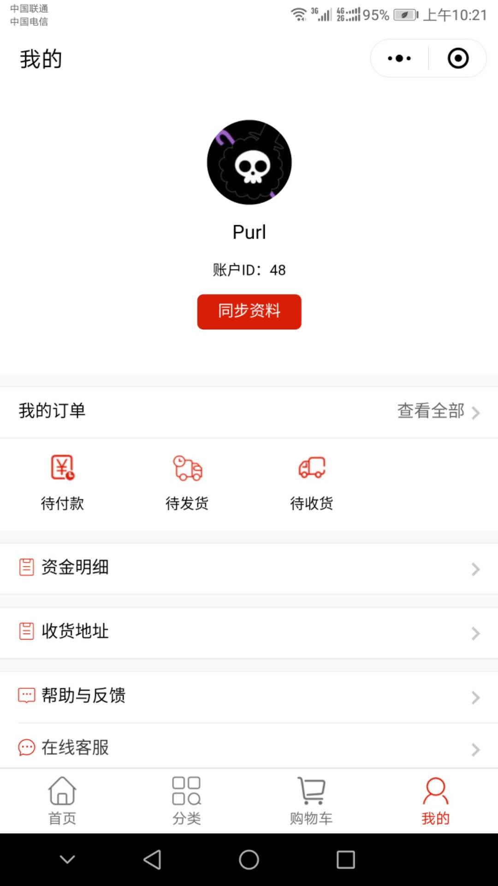
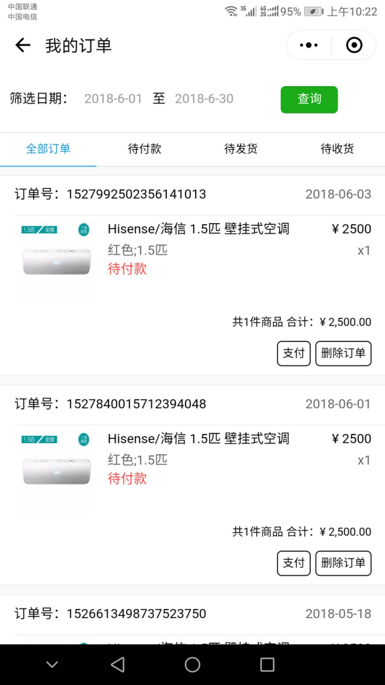
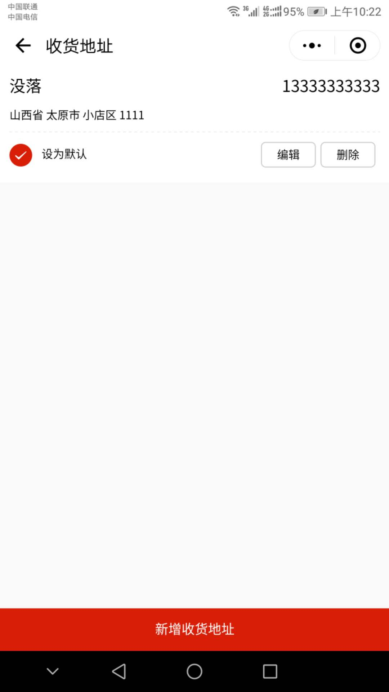

# Dsshop
dsshop是一套轻量级的网上购物系统，通过dsshop可以快速搭建成品商城系统，微信小程序商城，微信小程序微店，长期维护版本，欢迎大家踊跃提交贡献代码；

## dsshop故事
>
> 看了下微信小程序官方论坛（开发这套系统的时候），并未发现有开源前后端源码的（包括微信小程序和后台程序）。
> 于是就花了一些时间把原DSSHOP项目单独整理了一份适用于微信小程序的版本。

## 商城系统介绍

商城系统又叫网上商城系统，英文是Online Mall system，这个单词最先提出的是英国的Lap公司，该公司在中国大陆设有分公司，1998年，当时英国在线购物刚刚起步，Lap在英国系统开发方面已经小有名气，为规范市场称谓，则提出Online Mall system统一名称，同时还提出了Online Shopping System（网上购物系统），Online store system（网上商店系统），后被引入中国，亦是现在的网上购物系统。

## Dsshop发展历史

这里不做过多介绍，有兴趣的可以查看Dsshop老版本的说明，地址为：https://github.com/tifaweb/dswjshop

## 参与开发

更多项目请关注 [https://github.com/tifaweb](https://github.com/tifaweb)。
- 小程序UI部分使用 [@zanui-weapp](https://github.com/youzan/zanui-weapp)
- 产品设计 & UI [@DSWJCMS](https://www.dswjcms.com)
- 小程序开发 [@DSWJCMS](https://www.dswjcms.com)
- 接口及PHP后台开发 [@DSWJCMS](https://www.dswjcms.com)

期待您的加入~ ,欢迎大家踊跃提交代码。

开发问题欢迎一起交流 ： QQ交流群：164786488（注明商城微信小程序）

## Dsshop说明（重要）

1、dsshop后端基于TP3.1开发，项目下载后包含后端源码和微信小程序源码，按说明搭建完成后可直接上线使用。

2、微信小程序后端需要搭建在服务器上才可在微信小程序中被配置

# Dsshop版本说明

2018年06月07日	2.4.1发布，修复部分BUG	

# Dsshop使用要求

1、无任何技术要求，我们的项目全是模块化的，初始安装无任何附加插件，所有插件或模板都可以通过官方提供的插件模板市场进行下载，插件模板的安装也都提供教程，只需几步即可，无需修改源代码，也不需要了解项目目录结构；简单的说只要PHP环境已配置好，会上传文件和解压文件，会浏览器网站，那么你就可以利用我们的项目搭建属于自己的平台。

2、如你想对我们的项目进行二次开发，要求就比较高了：从事PHP研发工作2年以上，至少参与功能的研发与扩展，需熟练掌握ThinkPHP3.1框架的使用。

3、对微信小程序开发有一定的了解，能读懂微信小程序开发文档

# Dsshop建站流程

1、下载dsshop源码

2、上传到服务器，运行域名/install.php

3、一路下一步，填写数据库用户名、密码、表名

4、项目搭建完成

5、通过官方插件模板市场选择喜欢的模板点击下载

6、根据模板安装说明，轻松几步完成模板替换

7、通过官方插件模板市场选择所需的功能插件（如支付接口、短信接口）

8、根据插件安装说明，轻松几步完成插件安装

9、填写插件所需相关配置，完成插件的应用

10、项目对外发布，上线运营。

# dsshop演示地址

http://dswjshopbasis.tifaweb.com

# Dsshop微信小程序搭建流程

1、打开dsshop目录，将该目录下的dsshop目录拷贝到微信小程序开发目录下

2、打开微信开发工具->新建项目，把dsshop项目导入，然后填写自己的AppID,修改项目名称为自己的项目名称

3、导入项目成功后，需要修改config.js，在微信开发者工具中，点击config.js文件，找到“var host = "填写自己的服务器地址"”，修改地址为服务器地址（即服务器访问的dsshop项目地址）

4、修改dsshop（PHP端），路径：Lib\Action\Api\IndexAction.class.php里的getwxopenID方法，将小程序appid和小程序secret填写上去

5、修改代码里的信息，然后上传，微信小程序后台提示

6、项目对外发布，上线运营

# dsshop微信小程序演示地址

# dsshop微信小程序截图效果

# Dsshop环境要求

1、php5+mysql5+APACHE2（推荐php版本在3以上）

2、云服务器或以上配置，具备独立安装PHP环境

3、windows、linux系统都支持

# 常见问题解答

Q：你们的系统是免费的嘛？

D：可以理解为免费，因为我们允许你将我们的项目直接用于商业运营或二次开发后用于商业运营，但实际如果你想用于商业运营，但不想保留我们可见的版权信息时，那你就需要购买我们的版权，授权费用为1元/年

Q：这个项目是个人的不是公司的？

D：这个项目对外发布、版权都是以公司名义发布的，但和个人发布项目差不多，不存在收费项目，所有功能所见即所得，你看到的效果是什么样的，你下载源码搭建后得到的就是什么样的，

Q：商业授权码是什么？

D：当你的平台对外发布时，不想显示DSWJCMS相关版权信息时，需要购买商业授权码，授权为终身，可在官网上进行授权查询：http://www.dswjcms.com/Index/demand.html

Q：安装后只能显示首页，其它页面显示404页？

D：
1、Apache配置文件httpd.conf中查找mod_rewrite.so，将LoadModule rewrite_module modules/mod_rewrite.so前面的#去掉

2、如还不能解决下载兼容版

3、Apache配置文件httpd.conf中查找AllowOverride None 将None改为 All 

Q：Linux安装、上传图片无法实现？

D：Linux需要设置权限为7777

Q：项目样式错乱或进入后台发现布局错乱？

D：我们的项目因进行了伪静态操作，所以请上传到服务器进行操作，并确保项目放在环境根目录下或已做过多站点配置。

Dswjcms开源项目唯一官网：http://www.dswjcms.com ，我们的目的，将开源进行到底，分享是一种精神，分享中获得的往往比金钱更重要。